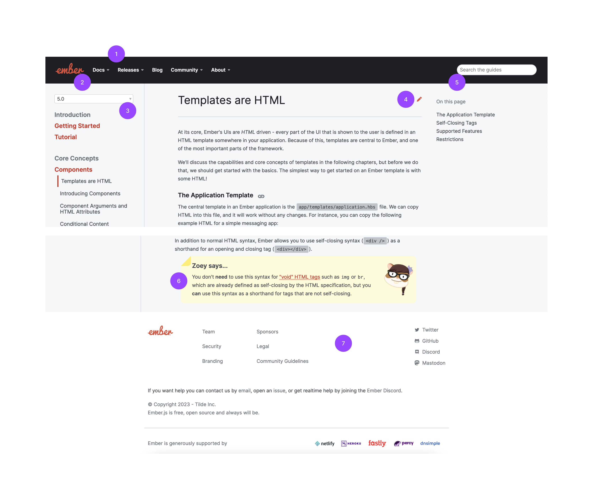

# Ember Guides in French 🇫🇷

A few months ago, I started a project that makes some people very enthusiastic and some other people very puzzled: translating the Ember Guides into my native language, French. In this article, I’ll explain why I did it, and how. Feel free to read only the parts you want depending on what brought you here ;)

✨ [Ember Guides in French](https://ember-fr-guides.netlify.app/release/) ✨

- [Translating the Ember Guides, why?](#translating-the-ember-guides-why)
  - [Language is part of accessibility](#language-is-part-of-accessibility)
  - [Making Ember (even) more accessible](#making-ember-even-more-accessible)
- [The translated website](#the-translated-website)
  - [Ember Guides’ ecosystem](#ember-guides-ecosystem)
  - [How to customize the UI](#how-to-customize-the-ui)
  - [How to spell-check the language](#how-to-spell-check-the-language)
  - [How to follow the updates of the official English docs](#how-to-follow-the-updates-of-the-official-english-docs)
- [Thanks](#thanks)

## Translating the Ember Guides, why?

### Language is part of accessibility

Ember Fest 2022, Paris, 1h30 by train from my home. I was having lunch with my husband (who is also an Ember developer) when another attendee joined us. He said he was from South Africa, he was traveling all over Europe. His trip had gone very well so far, but things had suddenly gotten more difficult when… he arrived in Paris! the city where people speak French. He looked at us and said, laughing: “You guys are the first French people I can have a conversation with!” I was so sorry to hear that. I think there are many cultural/political reasons why we French people have a terrible reputation when it comes to foreign languages. But a lot of experienced French web developers actually speak decent English.

So what is different about web developers? In two words: teamwork and resources. 

1. English is required because our domain is remote-friendly and the most interesting opportunities are offered by companies working at the very least with European teams. And maybe that’s for the best, English is a great string to have to your bow after all. But what if you don’t have it yet? What about developers - junior or not so junior - who never had the opportunity to practice with a European team?

2. English is required because most resources we need to grow are available only in this language. Developers who don’t benefit from “teamwork learning” will have to learn English anyway because reading most of the docs they need to get their job done is required.

But here is the situation: in your daily job, you look for documentation because you have a problem to solve. Learning English is pretty useful, but that’s not what you’re interested in right now. Right now you want to solve your problem. Getting the tech right through your reading is already an effort, but getting the tech right when you don’t even have a fluent understanding of the language used to write the doc and you need to rely on Google Trad’s more or less approximate suggestions… That can be a very discouraging challenge. In other words: a developer who doesn’t master English will have lower chances to withdraw all the benefits from reading that doc. I don’t know what you’d call this, I call this an accessibility issue.

### Making Ember (even) more accessible

> Accessible:
> - able to be reached or easily obtained
> - able to be entered or used by everyone, including people who use a wheelchair, people who are blind, etc.
> - **easy to understand** or enjoy
>
> [dictionary.cambridge.org](https://dictionary.cambridge.org/dictionary/english/accessible)

When we talk about accessibility in web development, we talk most of the time about implementing accessibility standards so the content of a web page can be accessed by all users whatever the tools they use to access it. For instance, using a `<nav>` tag to identify a navigation menu. In that sense, Ember makes accessibility a concern at the community level, the Ember Guides' content speaks for itself: [a complete guide is dedicated to accessibility](https://guides.emberjs.com/release/accessibility/) and several paragraphs along the Guides remind the Screen Reader recommendations to use them, including the very first page of the [Getting Started](https://guides.emberjs.com/release/getting-started/#toc_accessibility).

But accessibility has other meanings in the web development world, such as the accessibility of developer documentation. To be **easy to understand**, any content should have an identified target and prerequisites, and make sure it fits this promise. In practice, libraries are integrable in various stacks, so the documentation focuses on their specific job, and docs authors consider it counterproductive to mention what is out of the scope because it’s up to the docs’ consumer. The underlying issue is that it can be very hard for beginners (and even not-so-beginners sometimes) to understand how / where what they are reading is supposed to integrate into the environment. They might lack some basic knowledge to get started and they are left with no lead about what they are missing.

One thing I love about the Ember Guides is that there is no prerequisite to reading them because everything is explained: when a notion appears that is not specific to Ember and belongs more generally to web development, a short explanation and relevant links are available. Honestly, in all my career, the Ember ecosystem is the only one having documentation where I could read the following sentence: 

> _"First, we need to have a package manager installed. A package manager installs new dependencies from the command line, whether they are used as commands or in the app itself."_ 
> https://cli.emberjs.com/release/basic-use/

Most frameworks will do (when they do something) with a simple link to Node.js website and say “You need that”.

The effort put into the Ember Guides to help developers of any level to learn the framework is praiseworthy. It’s not just about learning Ember, it’s also about learning to be a better web developer by understanding what you are doing. For this reason, I think the Ember Guides deserve to be accessible to as many people as possible. In other words, they deserve to get translated, so developers who don’t master English can still master the tech.

## The translated website

The official Ember Guides don’t contain any language-switching mechanics, they’re written in English. The Ember Guides in French is a different website. The reason for this is really about maintenance cost: the Ember-Learn team doesn’t have the resources to maintain the different translations they would implement, so the translated website remains a separate community-driven project.

This stance makes things quite interesting on the technical side. How do you create the same website, but a little different though? For instance, if it’s not the same website, it has a different deployment pipeline, and it could be hosted by a different organization, so it won’t have the same footer information as the original website. Of course, you also want to explain your website is a community-driven translation of another open-source project, you need to put that somewhere. But still, it has to be more or less the same website, so you need to understand how it’s built to do _almost but not exactly_ the same thing.

The translated website [Ember FR Guides Source](https://github.com/DazzlingFugu/ember-fr-guides-source) is initially a fork of the [official Ember repository](https://github.com/ember-learn/guides-source). Then it has been customized piece by piece to fit the specific needs.

After building most of the French website, I identified three main technical parts that deserve to be presented in more detail:
1. How to customize the UI (👉 this is about Ember magic)
2. How to spell-check the language (👉 this is about configuring tools to analyze markdown files)
3. How to follow the updates of the official English docs (👉 this is about doing cool stuff with git)

To make this as interesting as possible, the French website has been developed with the idea that anyone speaking a different language could do the same work easily (at least more easily than it has been for us): the tools that have been built for the French website are meant to make customizable everything that was not customizable enough in the English website.

There is one first section below about the Ember Guides’ ecosystem, then the three next sections summarize how the French website was achieved, following the three aspects listed above. Each one will lead to another article to dive deeper into the technical details.

### Ember Guides’ ecosystem

The schema below shows the pieces that are somehow related to the translation work:

The code of the Ember Guides website is located on the open-source repository [Guides Source](https://github.com/ember-learn/guides-source). It’s an [Ember](https://github.com/emberjs/ember.js ) application, and its hierarchy matches any other Ember application, except that if you have a look at the `app/` folder, you’ll notice it’s surprisingly “empty”. This is because another tool is at the core of the structure: Guidemaker.

[Guidemaker](https://github.com/empress/guidemaker) is a fantastic tool developed by Chris Manson to implement a documentation site with EmberJS and markdown files. In very simple words, Guidemaker proposes you follow certain conventions (a `guides/` folder organized a certain way, an environment config…) and then it generates a documentation website out of it.

Guidemaker is meant to be used with a “template” addon that provides the themes and styling to the documentation website. [Guidemaker Default Template](https://github.com/empress/guidemaker-default-template) (linked on Guidemaker’s readme) is great to fork and start something new. The ember-learn organization owns its dedicated [Guidemaler Ember Template](https://github.com/ember-learn/guidemaker-ember-template) which provides the themes and styling to the Guides Source.

Guidemaker Ember Template itself relies on [Ember Styleguide](https://github.com/ember-learn/ember-styleguide), an addon that provides the shared themes and styling to all Ember official resources, not only the Guides Source made with Guidemaker.

As mentioned above, Guidemaker allows you to write your documentation files with markdown easily. To make sure your markdown files' semantics are correct and that you are not about to merge a page that cannot be interpreted in HTML, you need a linter. In the Guides Source, this job is done by a bunch of [remark packages](https://github.com/remarkjs/).

Additionally, any writer knows that spell-checking is not an option to produce qualitative content. Even people with good writing skills are not always able to see every single mistake they write or read, and even a minimalist spell-checking tool can point out a couple of careless mistakes. In Guides Source, that’s the role of [retext packages](https://github.com/retextjs).

### How to customize the UI

As mentioned before, the translated website is a different website. Let's consider a page of the Ember Guides at the moment I write these lines, and see everything we need to change:

1. We don't necessarily need the header menus that link to other non-translated Ember resources. The only website we want to link is the English website.

2. As our project is community-driven, it would be nice to have a French logo to highlight it's not properly an Ember-Learn team resource.

3. A dropdown allows users to navigate in older versions of the docs, so they can find information that matches the version of Ember they use. Maintaining such a documentation history would be too much work for our humble translation project, we want to stick to the latest version. In other words: we need to get rid of this dropdown.

4. The pencil icon is to encourage readers to contribute and improve the docs. It redirects to the GitHub location of the markdown and opens it in edit mode. It would be nice to keep this feature, but it needs to redirect to the translated website repository.

5. The search bar digs into the English docs. If we want to have it, we need to figure out how it's implemented and see what changes are required. It's also ok to not have it at the start.

6. Some visual elements of the page are clearly made with Ember components. We will need to make sure they integrate correctly into the translated website.

7. Our footer needs to be entirely different. The translated website is hosted by Netlify, it uses a different set of tools for CI, it’s not maintained by the Ember-Learn team, it wouldn’t make sense to mention the sponsors of the official website, the social media links should point to the translated website repository and maintainers, and last but not least: the descriptions and potential text links they contain should be written in French. 

We need to figure out the best way to customize all of the things we have listed here. It implies understanding who owns them and how they are rendered. Are the templates owned by `Guides Source`? by `Guidemaker Ember Template`? by `Ember Styleguide`? Is this element generated by `Guidemaker`? Are all the addons usable? do we need to create new ones?

If you want to dig into this with me to maybe create your own translation of the Ember Guides, have a look at the article [Customizing the UI](./ember-guides-in-french-ui-en.md).

### How to spell-check the language

A translation project is a great opportunity to dive into linters and spell-checking tools. In our case, it will be about [unifiedjs](https://unifiedjs.com/) world specifically.

> unified is an ecosystem for dealing with content as structured data. It consists of 500+ packages to do a wide variety of things. It’s used in 1m+ projects but a well-known example built on these packages is MDX. Maintaining all those projects takes a lot of time, which is why we’re on OpenCollective!
> https://opencollective.com/unified

To scope this a little bit to our project: `remark` packages are a bunch of packages we are going to use to lint our markdown files (the markdown syntax itself). `retext` packages are a bunch of packages we are going to use to spell-check French. And this whole family of packages is maintained by the same people from `unifiedjs` collective. Especially one guy, [Titus Wormer](https://github.com/wooorm) who - seems to be a huge penguin fan for some reason, and - is very reactive and willing to help on `remark` and `retext` discussion pages.

Here is the work that has been accomplished to lint and spell-check the French Ember Guides:
- Replace the English dictionary from Guides Source with a French dictionary. 
- Set up a "local dictionary" based on the "Ember dictionary" of Guides Source, add to it a bunch of English words commonly used in French and understand how to apply grammar rules to them.
- Stop spell-checking the English files that are not translated yet (because we no longer have the English dictionary to do it) and spell-check only the files translated into French.
- We decided to keep in English the links to resources (articles, websites...) available only in English. But the spell-checker doesn't recognize the words that compose these titles, so we implemented a custom "ignore" rule for our spell-checker (this part was a bit tricky and encouraged us to update the `remark`/`retext` dependencies that were outdated in Guides Source).

If you're interested in the technical details to achieve the above, have a look at the article [Spell-checking the language](./ember-guides-in-french-spell-en.md).

### How to follow the updates of the official English docs

In the Ember Guides, you can navigate to the documentation of all Ember versions starting `1.10`. Maintaining such a documentation history would be too much work for our humble translation project, we stick to the latest version.

But how to stay up to date? Let’s use the following scenario: we start the translation project by forking [Guides Source](https://github.com/ember-learn/guides-source) right after Ember 4.11 docs were pushed. We translate 50% of the website, then the learning team makes a new tag for Ember 4.12 docs. How to identify each English file that has been added, removed, or modified between 4.11 and 4.12 so we can adjust our translation to the new content? How to handle this as smoothly as possible?

There's room for nice automation tools here, but before making tools I like to have a very clear idea of the manual process and perform it a couple of times to be sure about my needs. Here is a summary of the manual process:
- Set up a "reference branch" `ref-upstream` that reflects the version of Guides Source currently under translation.
- When there's a new version on Guides Source, fetch `upstream/master` and compare it to `ref-upstream` to generate a diff between "under translation English" and "latest English".
- Go back to `master` and automatically apply the diff on the English files that haven't been translated yet.
- Handle manually the update of the translated files, directly or by opening new GitHub issues that will be tackled by translators at a later time.

If you're interested in taking a deeper look at the git commands behind these tasks to achieve something similar, have a look at the article [Following the changes in the official docs](./ember-guides-in-french-git-en.md).

## Thanks

I would like to thank all the people involved in this project, from the largest contributions to the humblest. I couldn't have gone so far without all of you.

For the technical part: [Chris Manson](https://github.com/mansona) and [Guillaume Gérard](https://github.com/GreatWizard/) 🙌

For the translation: [Agathe Badia](https://github.com/Agathebadia), [Mr Chocolatine](https://github.com/MrChocolatine), and [Benjamin Jegard](https://github.com/KamiKillertO) 🙌
