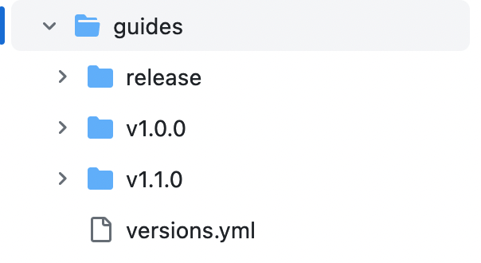

# Ember Guides in French 🇫🇷 - Customizing the UI

This article is part of the "Ember Guides in French 🇫🇷" series that introduces the French translation project for the Ember Guides. If you want to know more about the context, read [the introduction article](./ember-guides-in-french-en.md). The present article will detail how we customize the UI to include what is specific to the translated website. It is going to be about learning a bit of Ember magic 😉

## Context

Here is a reminder of the architecture schema described in [the introduction article](./ember-guides-in-french-en.md#ember-guides-ecosystem):


Let's consider a page of the Ember Guides at the moment I write these lines, and see everything we need to change for the translated website:


We need to figure out the best way to customize all of the things we have listed here. It implies understanding **who owns them and how they are rendered**. Are the templates owned by `Guides Source`? by `Guidemaker Ember Template`? by `Ember Styleguide`? Is this element generated by `Guidemaker`? Are all the addons usable? do we need to create new ones?

## Solution

### 1. The header

> We don't necessarily need the header menus that link to other non-translated Ember resources. The only website we want to link is the English website.

- _Who owns the header?_ `Ember Styleguide`
- _How is it rendered?_ The header is rendered by the component called `es-header`. `es-header` is invoked by `Guidemaker Ember Template` in `app/templates/application.hbs`.

`Ember Styleguide` provides shared themes and styling to all Ember official resources. Among other things, it provides components that are directly fed with Ember-related constants like the links to social media, the sponsors... exactly everything we don't want to put in the translated website. The translated website is not an _official_ Ember resource but a _community-driven_ resource, so it doesn't necessarily make sense to use `Ember Styleguide`. The header, with its hardly customizable content, shows that we somehow need to break up clearly with official Ember styles.

Along with this, `Guidemaker Ember Template` is by definition "a template made to display the Guidemaker doc in the Ember style". So if we don't want to use the Ember style in the first place, why would we use `Guidemaker Ember Template`? After all, `Guidemaker Ember Template` is the one that invokes `es-header`, so if we want to customize the header, we need to choose between making `Guidemaker Ember Template` more flexible or making our own Guidemaker template. The second solution sounds a lot easier to deal with for a first _community-driven_ project and allows us to work without rewriting `Guidemaker Ember Template`'s first purpose. 

And there is only one translated website, so we don't need any style guide to share our styles across several resources via an addon like `Ember Styleguide`. Let's start with a clean base:


[`Guidemaker Ember Locale Template`](https://github.com/DazzlingFugu/guidemaker-ember-locale-template) is a fork of [`Guidemaker Default Template`](https://github.com/empress/guidemaker-default-template). It will be "the template for any translation of the Ember Guides". Now, instead of trying to customize what is located in the `ember-learn` addons, we'll rather build upon what is provided by the default template.

__Do we have a default header in our fork?_ Yes, `Guidemaker Default Template` generates a header for the Guidemaker website. ⚠️ Now, each time a UI element of the official Guides is owned by `Guidemaker Ember Template`, we'll wonder if it's a specific addition or if this component was initially provided by `Guidemaker Default Template` (and then exists in our fork).

We'll learn later in this article how to customize a component like the header. For now, let's have a look at the other UI elements.

### 2. The logo

> As our project is community-driven, it would be nice to have a French logo to highlight it's not properly an Ember-Learn team resource. My colleague David designed an Ember logo prefixed with a French flag.

- _Who owns the logo?_ `Ember Styleguide`
- _How is it rendered?_ The logo is rendered by the component called `es-header` which provides a common header to Ember-related websites
- _Do we have a default logo in our fork?_ No, but we can configure one

The logo displayed in the header of the official guide is the logo provided by `Ember Styleguide`. Now that we work with our own Guidemaker template, the rendering of our logo is completely unrelated. We can simply use the Guidemaker-way to configure it. To display a logo in the generated website, we need to add a `guidemaker` field to the application config:

```js
// ember-fr-guides-source/config/environment.js

guidemaker: {
  title: 'Guide Ember.js 🇫🇷',
  logo: '/images/ember-fr-logo.svg',
},
```

By setting `guidemaker.logo` in the translated website's config, our logo shows out of the box. Under the hood, the default header generated by our Guidemaker template (the very header we haven't customized yet 😉) relies on a `guidemaker` service exposed by Guidemaker. This service reads the application config to make its fields easier to access from the different templates of the app.

### 3. The legacy versions dropdown

> A dropdown allows users to navigate in older versions of the docs, so they can find information that matches the version of Ember they use. Maintaining such a documentation history would be too much work for our humble translation project, we want to stick to the latest version. In other words: we need to get rid of this dropdown.

- _Who owns the versions dropdown?_ `Guidemaker Ember Template`
- _How is it rendered?_ By interesting cooperation between the Guidemaker template and the structure required by Guidemaker 😉
- _Do we have a default versions dropdown in our fork?_ Yes

`Guidemaker Default Template`'s dropdown is a `power-select` component invoked in `app/templates/versions`. It appears only if the property `this.versions` is defined. Now here comes Guidemaker's magic. `app/templates/versions` is a route template, but the route itself and its controller are defined in `Guidemaker`. To understand what's `this.versions`, we need to leave the template and dig into the actual tool.

The [controller](https://github.com/empress/guidemaker/blob/5b80495abde96351c1a42e3cf7a8f4f70c3bd283/addon/controllers/version.js#L19) tells us that `this.versions` will be undefined if we don't have any `allVersions`. And `allVersions` is part of the application's model called ["version"](https://github.com/empress/guidemaker/blob/5b80495abde96351c1a42e3cf7a8f4f70c3bd283/addon/models/version.js), which is [retrieved from the store](https://github.com/empress/guidemaker/blob/5b80495abde96351c1a42e3cf7a8f4f70c3bd283/addon/routes/application.js#L8). The store leads us to the application's adapter, and the adapter leads us to some [`content/`](https://github.com/empress/guidemaker/blob/5b80495abde96351c1a42e3cf7a8f4f70c3bd283/addon/adapters/application.js#L10) URL. By looking for `content/` in the repo, we finally land on [`guidemaker/index.js`](https://github.com/empress/guidemaker/blob/main/index.js#L233) where everything happens.

If we have a deep look at `this.getVersions()` and the `if` blocked linked above, what it tells us is that Guidemaker can manage two kinds of structure.

| The one that is documented: | But there's also another one: |
|----|----|
|  I have a `guides/` folder that contains one `release/` folder and `{version/}` folders that are described in the file `versions.yml` (list of all versions, what's the current version, what are the LTS versions)  | I have a `guides/` folder that contains my docs files at the root and `versions.yml` does not exist. |
|  |  |

In other words, in our `Ember FR Guides Source` application (which is initially a fork of the official doc), what we have to do is navigate into `guides/` folder, delete all the legacy Ember versions, delete `versions.yml`, move the content of `release/` to the root then delete the now empty `release/` folder. Then when we run the app, the dropdown is gone 🎉

### 4. The pencil icon

> The pencil icon is to encourage readers to contribute and improve the docs. It redirects to the GitHub location of the markdown and opens it in edit mode. It would be nice to keep this feature, but it needs to redirect to the translated website repository.

### 5. The search bar

> The search bar digs into the English docs. If we want to have it, we need to figure out how it's implemented and see what changes are required. It's also ok to not have it at the start.

- _Who owns the search bar?_ `Guidemaker Ember Template`
- _How is it rendered?_ The search bar is rendered by the component called `search-input`. `search-input` is invoked in `app/templates/application.hbs`, as the content block of `es-header`.
- _Do we have a default search bar in our fork?_ Yes

The search bars are components owned by Guidemaker templates. There is one in `Guidemaker Ember Template`, but there's also one provided by default in `Guidemaker Default Template`, so this one will exist in our fork. We need to figure out how to customize it to search through the French files, but that's not a priority for the project.

### 6. The components

> 6. Some visual elements of the page are clearly made with Ember components. We will need to make sure they integrate correctly into the translated website.

Let's take the example of the "Zoey says..." boxes:
- _Who owns Zoey?_ `Ember Styleguide`
- _How is it rendered?_ Native HTML embedded in a `<div class="cta">` is included in the markdown pages of the guide, and the CSS of `Ember Styleguide` applies to it. An image tag shows Zoey's picture. 

Everything coming from `Ember Styleguide` (including our poor Zoey) broke when we started to use our own `Guidemaker Ember Locale Template`. Components like Zoey's boxes are common components necessary to build any translated Ember Guides, so we want them to be [duplicated in `Guidemaker Ember Locale Template`](https://github.com/DazzlingFugu/guidemaker-ember-locale-template/blob/main/addon/styles/_note.scss). A bit of duplication here will make the whole thing easier to read and maintain than trying to have `Ember Styleguide` as a dependency, and it also allows us to modify a bit the copied files to provide a slightly different base of styles for translated websites.

### 7. The footer

> Our footer needs to be entirely different. The translated website is hosted by Netlify, it uses a different set of tools for CI, it’s not maintained by the Ember-Learn team, it wouldn’t make sense to mention the sponsors of the official website, the social media links should point to the translated website repository and maintainers, and last but not least: the descriptions and potential text links they contain should be written in French. 