# 🇺🇸 The EPUB format for dummies

> Copy and translation of my article in French published on Panodyssey on July 7, 2021.

Hello my budding weasels,

Outside, the sun is shining and the air is neither too hot nor too cold. It's perfect weather for a trip down to the lake. There, you'll unfold your towel on the sand and lie back with a good read, listening to the little birds and occasionally returning a couple of swans their haughty looks. A very good plan... Except you don't want to ruin your book on this excursion. Fortunately, it's the year 2021, so you own a e-reader. Ah, the digital book... you log in to your Kobo or Amazon account, choose your next reading, and bim... it's in the box, everything synchronizes automatically.

But what exactly are these files called “e-books” that you download onto your device? What's an “epub”, what's a “mobi”? If you're an author, and in particular a self-published author, you've probably already asked yourself this question. If you already know the answer, this article is probably not for you. This article is for you, on the other hand, if you think of these files as mysterious black boxes that you generate using tools without really understanding what they're all about.

In this article, we'll be talking about the EPUB format.

## An EPUB is an archive

### What is an archive?

The EPUB is what we call an archive. In computing, an archive is, roughly speaking, a file that contains other files, a bit like Mary Poppins' handbag: the handbag is an object in itself. Inside, you put a bunch of other things you need, and the whole thing weighs less than you'd expect. Ultimately, it's like a folder, but packaged, compacted, as a file. The best-known archive format here is probably “zip”. There's also “7z”, “rar”, “tar”... EPUB.

### Uncompressing an archive

So, to open the EPUB file and discover its inner workings, you need an archive manager: a small compression/uncompression program like the ones you use to open “zip” files. Windows Explorer contains one by default, but you're spoilt for choice. I use 7-Zip for Windows and Keka for MacOS.

https://www.7-zip.org/

https://www.keka.io/en/

### EPUB Content

An EPUB is an archive containing a files tree. By uncompressing it, you can navigate through this tree structure. Somewhere in there lies the text of your book. Not all EPUBs are alike, but they do share certain construction rules.

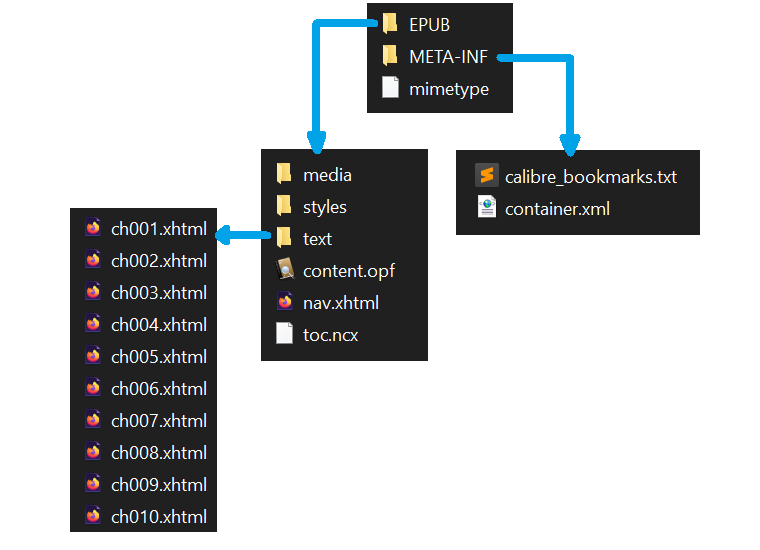

### Viewers

Viewers and other reading applications (such as Calibre viewer), as well as e-reader systems, are able to read the EPUB archive based on the construction rules common to all EPUBs. They understand the structure and know where to find the book's text, cover and font. The result is an attractive, easy-to-read layout.

Download the Calibre application, including Calibre viewer:

https://calibre-ebook.com/download

Is everything okay so far, weasels?

## EPUB construction rules

### 1 - EPUB is a Web standard

EPUB (electronic publication) is a standard defined by the W3C (World Wide Web Consortium). W3C's role is to recommend the best way to create Web pages, so that they are accessible to the greatest number of people, on the widest range of media.

Find out more about W3C:

https://www.w3.org/

What does EPUB have to do with Web? The technologies on which they are based. Browsing an unzipped EPUB, you'll find XHTML, CSS, PNG files... just like on the Web. An EPUB is a bit like a simplified Web page, whose content adapts to the reader.

```html
<?xml version="1.0" encoding="UTF-8"?>
<!DOCTYPE html>
<html xmlns="http://www.w3.org/1999/xhtml" xmlns:epub="http://www.idpf.org/2007/ops" xml:lang="fr-FR">
<head>
  <meta charset="utf-8" />
  <meta name="generator" content="pandoc" />
  <title>ch001.xhtml</title>
  <link rel="stylesheet" type="text/css" href="../styles/stylesheet1.css" />
</head>
<body epub:type="bodymatter">
<section id="carte-du-monde" class="level1 section">
<!-- <h1 class="unnumbered" data-number="">Carte du monde</h1> -->
<p></p>
</section>
</body>
</html>
```

### 2 - Popularizing the standard

The W3C specifications are very detailed and comprehensive, but they can be difficult to read for someone starting from scratch without knowing what to look for. We'll try to simplify them as much as possible in the following sections.

Complete EPUB 3.2 format specifications:

https://www.w3.org/publishing/epub32/epub-spec.html

#### 2.1 - The OPF file: the core of EPUB

The EPUB contains a master file that lists all the other files, media and metadata required to display the content of your book correctly. This “core” of the EPUB usually has the extension OPF.

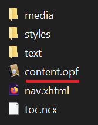

In fact, it's the OPF file that your e-reader looks for when you open an EPUB. On your computer, if your EPUBs open automatically with Calibre viewer and you unzip the archive, you may notice that the OPF file also has the Calibre icon.

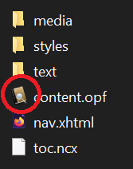

> 🦊 OPF, NCX and XHTML are text files!
> A little advice from weasel to weasel: don't be scared off by exotic file extensions like “OPF”, “NCX” or “XHTML”. Very often, these files contain nothing but text, and the extension only serves to identify them or determine how they are structured. 

The OPF file is perfectly readable using Windows Notepad, although it's not very easy to digest. To see the pretty colors that highlight its structure, drag it into a tab in your browser (e.g. Firefox). Developers, on the other hand, have more advanced text editors with syntax highlighting.

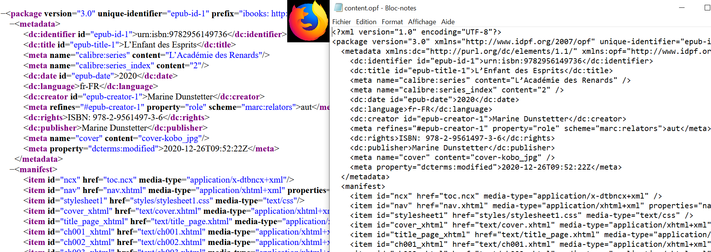

Now that you have the contents of the OPF in front of you, let's take a look at the various tags.

#### 2.1.1 - Metadata

Metadata is technical information about your book. They enable readers to display this information in specific places.

```html
<metadata xmlns:dc="http://purl.org/dc/elements/1.1/" xmlns:opf="http://www.idpf.org/2007/opf">
  <dc:identifier id="epub-id-1">urn:isbn:9782956149736</dc:identifier>
  <dc:title id="epub-title-1">L’Enfant des Esprits</dc:title>
  <dc:date id="epub-date">2020</dc:date>
  <dc:language>fr-FR</dc:language>
  <dc:creator id="epub-creator-1">Marine Dunstetter</dc:creator>
  <meta refines="#epub-creator-1" property="role" scheme="marc:relators">aut</meta>
  <dc:publisher>Marine Dunstetter</dc:publisher>
  <dc:rights>ISBN: 978-2-9561497-3-6</dc:rights>
  <meta name="cover" content="cover-kobo_jpg" />
  <meta property="dcterms:modified">2021-06-10T16:36:00Z</meta>
  <meta name="calibre:series" content="L'Académie des Renards" />
  <meta name="calibre:series_index" content="2" />
</metadata>
```

For example, when your reader displays “Author: Bella Belette” in the library, it's because the “dc:creator” metadata contains “Bella Belette”. The reader knows that the author's name is in the “dc:creator” metadata, so that's where it looks for it and finds it. If this metadata wasn't there, the reader wouldn't be able to guess who the author is, because it can't magically extract this information from the first few pages of the book.

When you use software like Calibre to “edit metadata”, Calibre will actually fill in each metadata of the OPF file with the information you have entered in the interface.

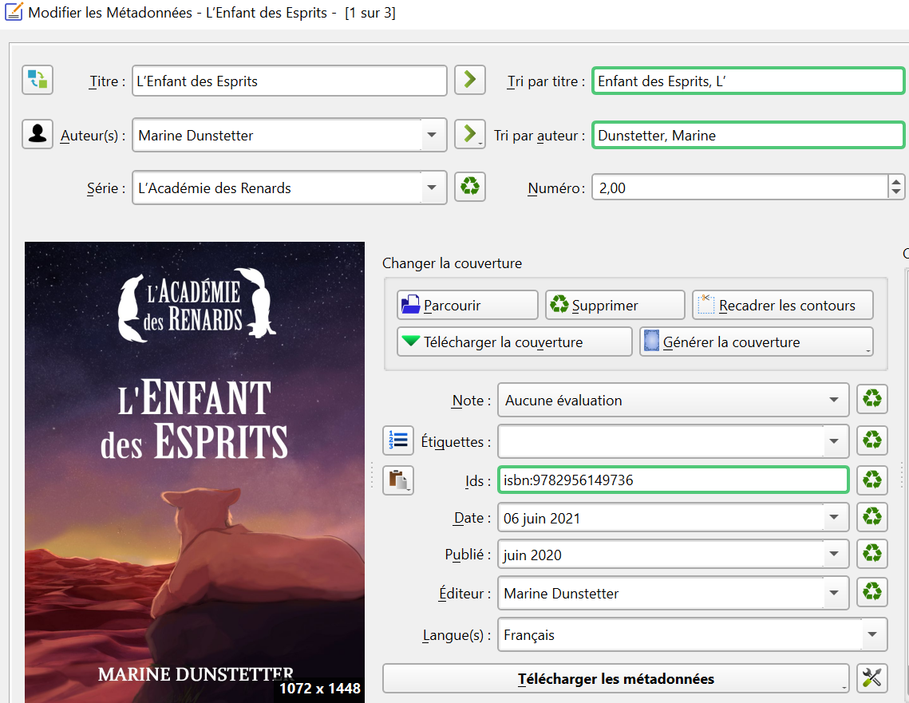

#### 2.1.2 The manifest

The role of the manifest is rather simple to understand. It's nothing but a list of all the files that make up the book. The manifest indicates the location of the table of contents, the title page, the chapters, the stylesheet containing the font to be used, etc. Each file making up the book is listed in an `<item>` tag.

```html
<manifest>
  <item id="ncx" href="toc.ncx" media-type="application/x-dtbncx+xml" />
  <item id="nav" href="nav.xhtml" media-type="application/xhtml+xml" properties="nav" />
  <item id="stylesheet1" href="styles/stylesheet1.css" media-type="text/css" />
  <item id="cover_xhtml" href="text/cover.xhtml" media-type="application/xhtml+xml" properties="svg" />
  <item id="title_page_xhtml" href="text/title_page.xhtml" media-type="application/xhtml+xml" />
  <item id="ch001_xhtml" href="text/ch001.xhtml" media-type="application/xhtml+xml" />
  <item id="ch002_xhtml" href="text/ch002.xhtml" media-type="application/xhtml+xml" />
  <item id="ch003_xhtml" href="text/ch003.xhtml" media-type="application/xhtml+xml" />
  <item id="ch004_xhtml" href="text/ch004.xhtml" media-type="application/xhtml+xml" />
  <item id="ch005_xhtml" href="text/ch005.xhtml" media-type="application/xhtml+xml" />
  <item id="ch006_xhtml" href="text/ch006.xhtml" media-type="application/xhtml+xml" />
  <!-- ... -->
```

By looking at the HTML block above, you can recognize the files containing the cover page and title page:

```html
<item id="cover_xhtml" href="text/cover.xhtml" media-type="application/xhtml+xml" properties="svg" />
<item id="title_page_xhtml" href="text/title_page.xhtml" media-type="application/xhtml+xml" />
```

In addition, each chapter is in a separate file called `ch00N.xhtml`, so the manifest lists one `<item>` tag per chapter.

This type of listing is very practical, as each file can be found in any folder in the tree structure. For example, you could put all your chapters in a folder called “honk” and indicate in the manifest that they are in “honk”. The EPUB structure is therefore very flexible.

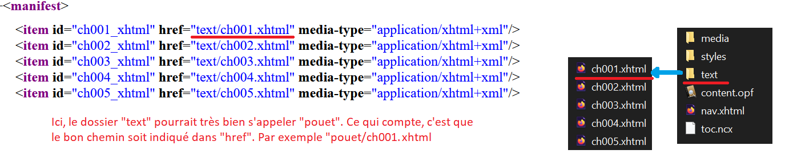

The manifest is not ordered, it's like a shopping list. The order in which you buy your products is not necessarily the order in which you marked them. So the manifest may say chapter 10, chapter 2, chapter 5... but this has no impact on the way the book is rendered. What matters is that everything is there.

#### 2.1.3 - The spine

The spine represents the order in which the files making up the book should be read. For example: first the cover, then the title page, then chapter 1, etc...

```html
<spine toc="ncx">
  <itemref idref="cover_xhtml" />
  <itemref idref="title_page_xhtml" linear="yes" />
  <itemref idref="ch001_xhtml" />
  <itemref idref="ch002_xhtml" />
  <itemref idref="ch003_xhtml" />
  <itemref idref="ch004_xhtml" />
  <itemref idref="ch005_xhtml" />
  <!-- ... -->
```

In short: the spine tells the reader the order in which to read the files in the book. For each file, it finds the corresponding identifier in the manifest and deduces, using the “href”, where the file is located.

```html
<spine toc="ncx">
  <itemref idref="ch001_xhtml" />
  <!-- ... -->

<manifest>
  <item id="ch001_xhtml" href="text/ch001.xhtml" media-type="application/xhtml+xml" />
  <!-- ... -->
```

We've taken a tour of the OPF file's main tags: metadata for technical information, manifest to list files and their location, spine to indicate the reading order to the reader.

### 2.2 - Navigation

When we talk about navigation, we're talking about how your reader displays the table of contents, and how you interact with this menu.

#### 2.2.1 - The spine is not enough

How does the reader display the table of contents? The OPF spine alone enables the reader to display something that more or less resembles it. Calibre viewer, for example, is able to detect chapter titles if they exist, but displays an “unlabeled” entry for pages without text (cover, world map...)

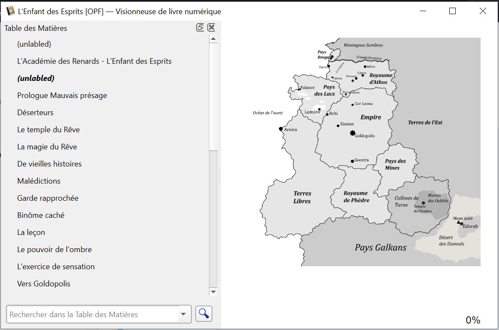

And this is where the EPUB format's “Navigation Document” comes in. Navigation must be explicitly described. However, if you go through your EPUB and read the various files, you may well find your summary in two different places, as in the screenshot below.

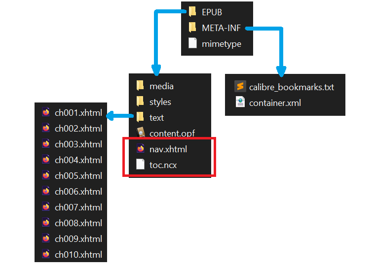

#### 2.2.2 - NCX et <nav>, deux façons de naviguer

There are two files that can contain the table of contents. The first has the extension NCX. The second can be called “nav.xhtml”, and inside, your table of contents is contained in a `<nav epub:type=“toc”>` tag. But why two files to do the same thing?


In fact, the EPUB format is not set in stone. It's evolving! The W3C is constantly working to improve its recommendations. That's why we sometimes see two approaches that do the same thing in the same EPUB: one is “new” (and therefore undoubtedly better in terms of accessibility and modernity), and the second is “old”. The advantage of having both coexist is that the EPUB will adapt to more reading devices. Indeed, if your device is too old, it may not understand how to interpret the more modern structure.

For navigation, the old way is NCX, and the modern way is to use a `<nav epub:type=“toc”>` tag. It is preferable to have NCX, so that older readers can interpret the table of contents correctly.

### 2.3 - The mimetype

The mimetype (or MIME type, for Multipurpose Internet Mail Extensions) is a tiny file that must be located at the root of your EPUB. 

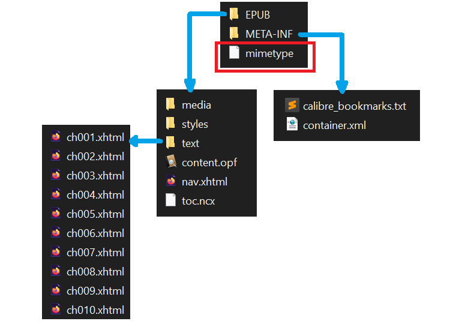

It contains the text “application/epub+zip”, and simply indicates that your EPUB is an EPUB. Other MIME types exist for other document types.

The most common MIME types:

https://developer.mozilla.org/en-US/docs/Web/HTTP/Basics_of_HTTP/MIME_types/Common_types

### 2.4 - The META-INF folder

The META-INF folder must be located at the root of your EPUB. It contains certain specific files.

#### 2.4.1 - Container

The only mandatory file is called “container.xml”. It enables the e-reader to locate the OPF. For this very reason, you are free to organize your files as you like and place your OPF anywhere in your tree structure. Because “META-INF/container.xml” is mandatory, your reader knows that this is where it will find the path to the OPF, and the OPF itself provides the path to all other files.

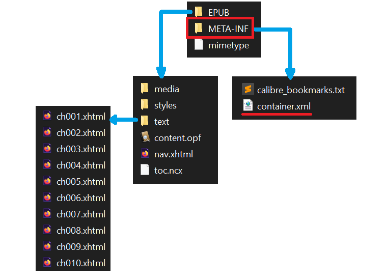

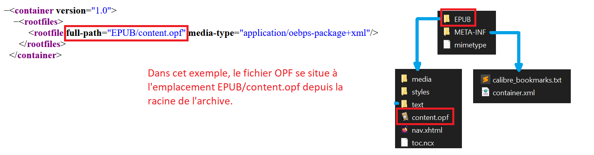

#### 2.4.2 - DRM

META-INF may contain other files, particularly those relating to DRM.

META-INF file specifications:

https://www.w3.org/publishing/epub32/epub-ocf.html#sec-container-abstract

We won't go into detail about the use of DRM in this article, as I haven't done the resear... I mean... as this topic strays from an initial popularization of the format.

## 3 - Specification versions

We've already seen the broad outlines of the EPUB format. If you want to go further, you can take another look at the W3C specifications. The keys you now have in hand will help you read them a little more easily.

Overview of the EPUB format:

https://www.w3.org/TR/epub-overview-33/

As you can see from the navigation example, the EPUB format is not set in stone. That's why links to different versions are provided on the “EPUB 3 Overview” page. Before reading a specification, pay attention to the version you're interested in.  

At the time of writing, the version considered to be “the current standard” is version 3.2, whose URL is as follows:

https://www.w3.org/publishing/epub32/epub-spec.html

Version 3.3 is set to become the new standard, but is still in the draft phase:

https://www.w3.org/TR/epub-33/

That's it for the EPUB construction rules. I hope this article has given you a better understanding of how it's constructed. With this knowledge, and a little mastery of HTML and CSS formatting languages, you'll be able to control the rendering of your book with great precision ;-)
