# 🇫🇷 Le format EPUB pour les nuls

> Copie de mon article publié sur Panodyssey le 7 juillet 2021

Bonjour mes belettes en herbe,

Dehors, il fait un brin de soleil, l'air n'est ni trop chaud ni trop froid. C'est le temps parfait pour une petite virée jusqu'au lac. Là-bas, vous déplierez votre serviette sur le sable et vous allongerez avec une bonne lecture, en écoutant les petits oiseaux et en rendant de temps à autre à un couple de cygnes leurs regards hautains. Un très bon plan... Sauf que vous n'avez pas envie d'abîmer votre livre pendant cette excursion. Heureusement, on est en 2021, vous possédez donc une liseuse. Ah, le livre numérique... on se connecte à son compte Kobo ou Amazon, on choisit sa prochaine lecture, et bim... c'est dans la boîte, tout se synchronise automatiquement.

Mais que sont exactement ces fichiers appelés "e-book" que vous téléchargez sur votre appareil ? Qu'est-ce qu'un "epub", qu'est-ce qu'un "mobi" ? Si vous êtes auteur, et en particulier auteur auto-édité, vous vous êtes sans doute déjà posé la question. Si vous connaissez déjà la réponse, cet article n'est probablement pas fait pour vous. Cet article est fait pour vous, en revanche, si ces fichiers sont pour vous de mystérieuses boîtes noires que vous générez à l'aide d'outils sans comprendre concrètement de quoi il en retourne.

Dans cet article, nous allons parler du format EPUB.

## Un EPUB est une archive

### Qu'est-ce qu'une archive ?

Le EPUB est ce qu'on appelle une archive. En informatique, une archive, c'est, grosso modo, un fichier qui contient d'autres fichiers, un peu comme le sac à main de Mary Poppins : le sac à main est un objet en soi. À l'intérieur, vous mettez un tas d'autres objets dont vous avez besoin, et l'ensemble pèse moins lourd que ce à quoi on pourrait s'attendre. Finalement, c'est comme un dossier, mais empaqueté, compacté, sous forme de fichier. Le format d'archive le plus connu par chez nous est probablement le "zip". Il y a aussi le "7z", le "rar", le "tar"... le EPUB.

### Décompresser une archive

Ainsi, pour ouvrir le fichier EPUB et découvrir ses rouages internes, vous avez besoin d'un gestionnaire d'archive : un petit logiciel de compression/décompression comme ceux qui vous permettent d'ouvrir les "zip". L'explorateur de Windows en contient un par défaut, mais vous avez l'embarras du choix. Moi, j'utilise 7-Zip sous Windows et Keka sous MacOS.

https://www.7-zip.org/

https://www.keka.io/en/

### Contenu d'un EPUB

Le EPUB est donc une archive contenant une arborescence de fichiers. En le décompressant, vous pouvez naviguer à travers cette arborescence. Quelque part s'y cache le texte de votre livre. Tous les EPUB ne se ressemblent pas, mais ils partagent certaines règles de construction.

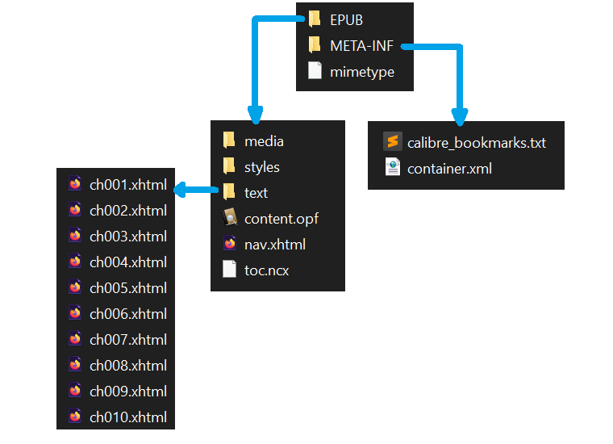

### Les visionneuses

Les visionneuses et autres applications de lecture (comme Calibre viewer) ainsi que les systèmes des liseuses sont capables de lire l'archive EPUB en s'appuyant sur les règles de construction communes à tous les EPUB. Elles en comprennent la structure et savent où trouver le texte du livre, sa couverture, ou encore sa police d'écriture. Ainsi, elles génèrent un joli rendu, agréable à lire.

Télécharger l'application Calibre, incluant Calibre viewer :

https://calibre-ebook.com/fr/download

Est-ce que tout va bien jusque-là, les belettes ?

## Les règles de construction du EPUB

### 1 - Le EPUB est une norme du Web

Le EPUB (electronic publication) est une norme définie par le W3C (World Wide Web Consortium). Le rôle du W3C est de recommander la meilleure manière de créer les pages Web, afin qu'elles soient accessibles au plus grand nombre, sur le plus de supports différents.

Tout savoir sur le W3C :

https://www.w3.org/

Quel rapport entre le EPUB et le Web ? Les technologies sur lesquelles ils reposent. En naviguant dans un EPUB décompressé, vous allez trouver des fichiers XHTML, CSS, PNG... comme en Web. Le EPUB, c'est un peu comme une page Web simpliste, dont le contenu s'adapte à la liseuse. 

```html
<?xml version="1.0" encoding="UTF-8"?>
<!DOCTYPE html>
<html xmlns="http://www.w3.org/1999/xhtml" xmlns:epub="http://www.idpf.org/2007/ops" xml:lang="fr-FR">
<head>
  <meta charset="utf-8" />
  <meta name="generator" content="pandoc" />
  <title>ch001.xhtml</title>
  <link rel="stylesheet" type="text/css" href="../styles/stylesheet1.css" />
</head>
<body epub:type="bodymatter">
<section id="carte-du-monde" class="level1 section">
<!-- <h1 class="unnumbered" data-number="">Carte du monde</h1> -->
<p></p>
</section>
</body>
</html>
```

### 2 - Vulgarisons la norme

Les spécifications du W3C sont très détaillées et complètes, mais elles peuvent paraître difficiles à lire pour qui part de zéro sans savoir quoi chercher. Nous allons tenter de les simplifier un maximum dans les prochaines sections.

Spécifications complètes du format EPUB 3.2 :

https://www.w3.org/publishing/epub32/epub-spec.html

#### 2.1 - Le fichier OPF : le cœur du EPUB

Le EPUB contient un fichier maître qui liste tous les autres fichiers, médias et metadata nécessaires pour afficher correctement le contenu de votre livre. Ce "cœur" du EPUB porte généralement l'extension OPF.

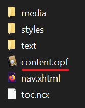

C'est en fait le fichier OPF que recherche votre liseuse quand vous ouvrez un EPUB. D'ailleurs, sur votre ordinateur, si vos EPUB s'ouvrent automatiquement avec Calibre viewer et que vous décompressez l'archive, vous remarquerez peut-être que le fichier OPF possède aussi l'icône de Calibre.

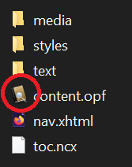

> 🦊  OPF, NCX et XHTML sont des fichiers textes !
> Petit conseil de belette à belette : ne soyez pas effrayés par les extensions de fichier exotiques comme "OPF", "NCX" ou "XHTML". Très souvent, ces fichiers ne contiennent que du texte, et l'extension ne sert qu'à les identifier ou à déterminer de quelle manière ils sont structurés. 

Le fichier OPF est parfaitement lisible à l'aide du Bloc-notes de Windows, bien que ce ne soit pas très digeste. Pour voir de jolies couleurs qui mettent en avant sa structure, glissez-le dans un onglet de votre navigateur (par exemple Firefox). Les développeurs, eux, possèdent des éditeurs de texte plus poussés avec une coloration syntaxique.

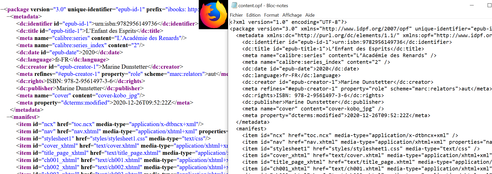

Une fois que vous avez sous les yeux le contenu du OPF, intéressons-nous aux différentes balises.

#### 2.1.1 - Les metadata

Les "metadata" (ou métadonnées en bon français) sont des informations techniques qui concernent votre livre. Elles permettent aux liseuses d'afficher ces informations à des endroits bien précis.

```html
<metadata xmlns:dc="http://purl.org/dc/elements/1.1/" xmlns:opf="http://www.idpf.org/2007/opf">
  <dc:identifier id="epub-id-1">urn:isbn:9782956149736</dc:identifier>
  <dc:title id="epub-title-1">L’Enfant des Esprits</dc:title>
  <dc:date id="epub-date">2020</dc:date>
  <dc:language>fr-FR</dc:language>
  <dc:creator id="epub-creator-1">Marine Dunstetter</dc:creator>
  <meta refines="#epub-creator-1" property="role" scheme="marc:relators">aut</meta>
  <dc:publisher>Marine Dunstetter</dc:publisher>
  <dc:rights>ISBN: 978-2-9561497-3-6</dc:rights>
  <meta name="cover" content="cover-kobo_jpg" />
  <meta property="dcterms:modified">2021-06-10T16:36:00Z</meta>
  <meta name="calibre:series" content="L'Académie des Renards" />
  <meta name="calibre:series_index" content="2" />
</metadata>
```

Par exemple, quand votre liseuse affiche "Auteur : Bella Belette" dans la bibliothèque, c'est parce que la metadata "dc:creator" contient "Bella Belette". La liseuse sait que le nom de l'auteur se trouve dans la metadata "dc:creator", c'est donc là qu'elle le cherche et le trouve. Si cette metadata était absente, la liseuse ne pourrait pas deviner qui est l'auteur, elle n'est pas capable d'extraire cette information dans les premières pages du livre.

Quand vous utilisez un logiciel comme Calibre pour "éditer les métadonnées", Calibre va en fait remplir chaque metadata du fichier OPF avec les informations que vous aurez entrées dans l'interface.

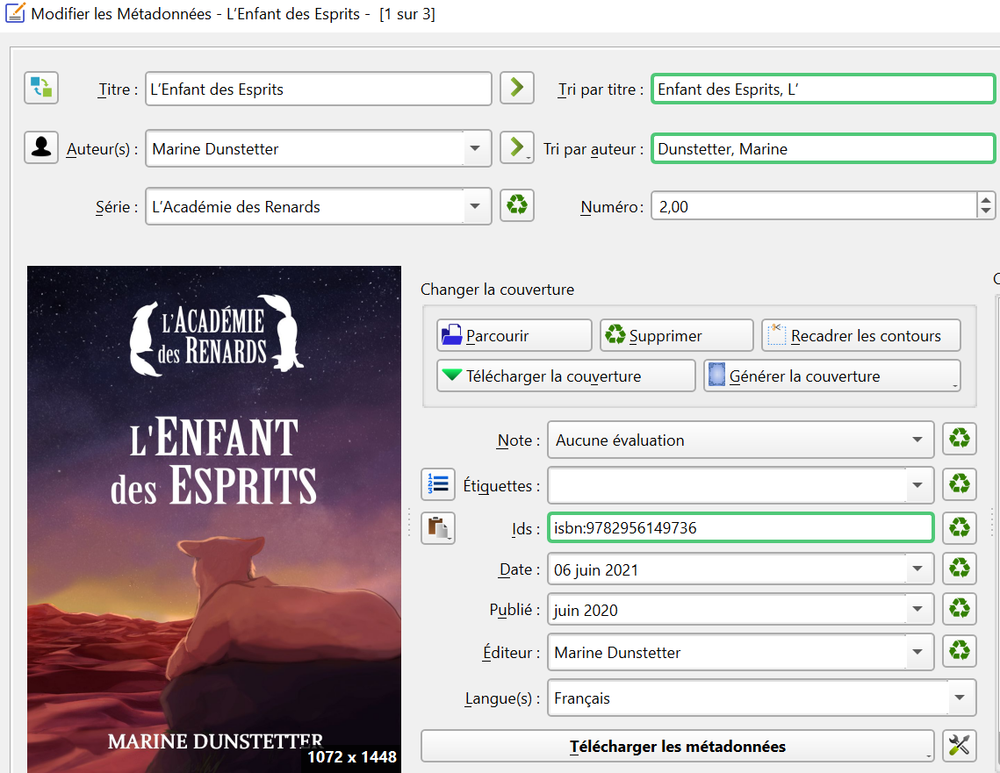

#### 2.1.2 Le manifest

Le rôle du manifest est très simple à comprendre. C'est tout bonnement une liste de tous les fichiers qui composent le livre. Le manifest indique où se trouve le sommaire, la page de titre, les chapitres, la feuille de style qui indique la police de caractère à utiliser, etc... chaque fichier qui compose le livre est listé dans une balise `<item>`.

```html
<manifest>
  <item id="ncx" href="toc.ncx" media-type="application/x-dtbncx+xml" />
  <item id="nav" href="nav.xhtml" media-type="application/xhtml+xml" properties="nav" />
  <item id="stylesheet1" href="styles/stylesheet1.css" media-type="text/css" />
  <item id="cover_xhtml" href="text/cover.xhtml" media-type="application/xhtml+xml" properties="svg" />
  <item id="title_page_xhtml" href="text/title_page.xhtml" media-type="application/xhtml+xml" />
  <item id="ch001_xhtml" href="text/ch001.xhtml" media-type="application/xhtml+xml" />
  <item id="ch002_xhtml" href="text/ch002.xhtml" media-type="application/xhtml+xml" />
  <item id="ch003_xhtml" href="text/ch003.xhtml" media-type="application/xhtml+xml" />
  <item id="ch004_xhtml" href="text/ch004.xhtml" media-type="application/xhtml+xml" />
  <item id="ch005_xhtml" href="text/ch005.xhtml" media-type="application/xhtml+xml" />
  <item id="ch006_xhtml" href="text/ch006.xhtml" media-type="application/xhtml+xml" />
  <!-- ... -->
```

En observant le bloc de HTML ci-dessus, vous pouvez reconnaître les fichiers contenant la page de couverture et la page de titre :

```html
<item id="cover_xhtml" href="text/cover.xhtml" media-type="application/xhtml+xml" properties="svg" />
<item id="title_page_xhtml" href="text/title_page.xhtml" media-type="application/xhtml+xml" />
```

De plus, chaque chapitre se trouve dans un fichier séparé appelé `ch00N.xhtml`, donc le manifeste liste une balise `<item>` par chapitre.

Ce type de liste est très pratique, car chaque fichier peut se trouver dans n'importe quel dossier de l'arborescence. Vous pourriez très bien ranger tous vos chapitres dans un dossier appelé "pouet" et indiquer dans le manifest qu'ils se trouvent dans "pouet". La structure du EPUB est donc très souple.

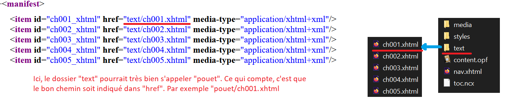

Le manifest n'est pas ordonné, c'est comme une liste de courses. L'ordre dans lequel vous achetez vos produits n'est pas forcément celui dans lequel vous les avez marqués. Le manifest peut donc indiquer chapitre 10, chapitre 2, chapitre 5... cela n'a aucun impact sur le rendu du livre. Ce qui compte, c'est que tout y soit.

#### 2.1.3 - Le spine

Le spine représente l'ordre dans lequel les fichiers qui composent le livre doivent être lus. Par exemple : d'abord la couverture, puis la page de titre, puis le chapitre 1, etc...

```html
<spine toc="ncx">
  <itemref idref="cover_xhtml" />
  <itemref idref="title_page_xhtml" linear="yes" />
  <itemref idref="ch001_xhtml" />
  <itemref idref="ch002_xhtml" />
  <itemref idref="ch003_xhtml" />
  <itemref idref="ch004_xhtml" />
  <itemref idref="ch005_xhtml" />
  <!-- ... -->
```

En résumé : le spine dit à la liseuse l'ordre dans lequel lire les fichiers du livre. Pour chaque fichier, elle trouve dans le manifest l'identifiant correspondant et en déduit, à l'aide du "href", où se trouve le fichier.

```html
<spine toc="ncx">
  <itemref idref="ch001_xhtml" />
  <!-- ... -->

<manifest>
  <item id="ch001_xhtml" href="text/ch001.xhtml" media-type="application/xhtml+xml" />
  <!-- ... -->
```

Nous avons fait le tour des principales balises du fichier OPF : des metadata pour les informations techniques, le manifest pour lister les fichiers et leur emplacement, le spine pour indiquer à la liseuse l'ordre de lecture.

### 2.2 - La navigation

Quand on parle de navigation, on parle de la manière dont votre liseuse affiche la table des matières, et de quelle façon vous interragissez avec ce menu.

#### 2.2.1 - Le spine ne suffit pas

Mais comment la liseuse affiche-t-elle la table des matières ? Le spine du OPF, seul, permet à la liseuse d'afficher quelque chose qui y ressemble plus ou moins. Calibre viewer, par exemple, est capable de détecter les titres de chapitres s'ils existent, mais affiche une entrée "unlabeled" pour les pages sans texte (couverture, carte du monde...)

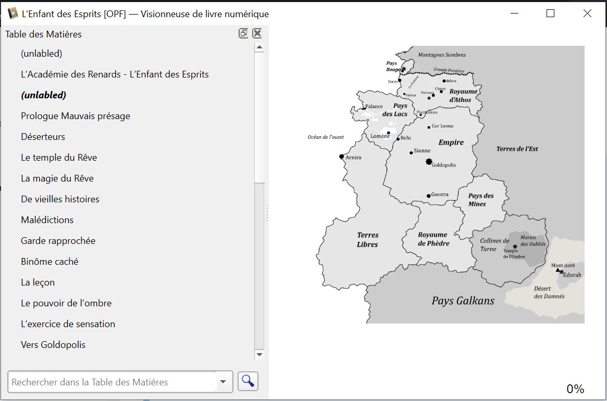

Et c'est là que le "Navigation Document" du format EPUB entre en scène. La navigation doit être explicitement décrite. Or, si vous vous promenez dans votre EPUB et lisez les différents fichiers, vous risquez bien de trouver votre sommaire à deux endroits différents, comme dans la capture ci-dessous.

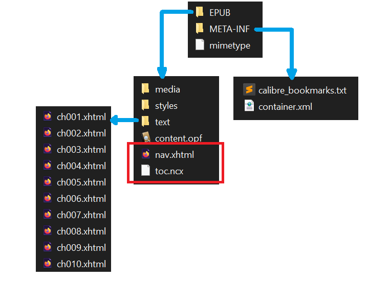

#### 2.2.2 - NCX et <nav>, deux façons de naviguer

Il existe deux fichiers qui peuvent contenir la table des matières. Le premier possède l'extension NCX. Le second peut s'appeler "nav.xhtml", et à l'intérieur, votre table des matières est contenue dans une balise `<nav epub:type="toc">`. Mais pourquoi deux fichiers pour faire la même chose ?


En fait, le format EPUB n'est pas gravé dans le marbre. Il évolue ! Le W3C travaille sans cesse à améliorer ses recommandations. Voilà pourquoi il arrive de voir coexister deux approches qui font la même chose dans le même EPUB : l'une des deux est "nouvelle" (donc sans doute meilleure en termes d'accessibilité et de modernité), et la seconde "ancienne".

L'avantage de faire coexister les deux, c'est que le EPUB va s'adapter à davantage de liseuses. En effet, si votre appareil est trop ancien, il risque de ne pas comprendre comment interpréter la structure la plus moderne.

Concernant la navigation, la vieille méthode est le NCX, et la méthode moderne l'utilisation d'une balise `<nav epub:type="toc">`. Il est préférable que le NCX soit présent, de manière à ce que les liseuses les plus anciennes puissent interpréter correctement la table des matières.

### 2.3 - Le mimetype

Le mimetype (ou type MIME, pour type Multipurpose Internet Mail Extensions) est un minuscule fichier devant impérativement se trouver à la racine de votre EPUB. 

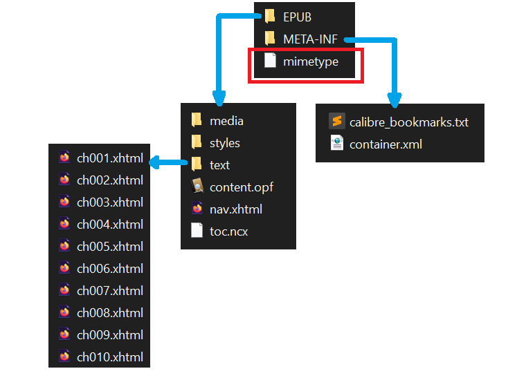

Il contient le texte "application/epub+zip", et indique simplement que votre EPUB est un EPUB. Il existe d'autres types MIME pour d'autres types de document.

Les types MIME les plus courants :

https://developer.mozilla.org/fr/docs/Web/HTTP/Basics_of_HTTP/MIME_types/Common_types

### 2.4 - Le dossier META-INF

Le dossier META-INF est un dossier devant impérativement se trouver à la racine de votre EPUB. Il contient certains fichiers bien précis.

#### 2.4.1 - Container

Le seul fichier obligatoire s'appelle "container.xml" et permet à la liseuse de situer l'emplacement du fameux OPF. C'est pour cette raison que vous êtes libre d'organiser vos fichiers comme bon vous semble et que vous pouvez placer votre OPF n'importe où dans votre arborescence. Comme "META-INF/container.xml" est obligatoire, votre liseuse sait que c'est à cet emplacement qu'elle trouvera le chemin vers le OPF, le OPF donnant lui même le chemin vers tous les autres fichiers.

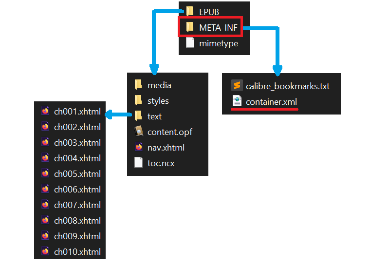

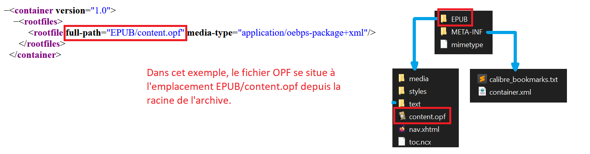

#### 2.4.2 - DRM

META-INF peut contenir d'autres fichiers, notamment relatifs aux DRM.

Spécifications du dossier META-INF :

https://www.w3.org/publishing/epub32/epub-ocf.html#sec-container-abstract

Nous ne détaillerons pas l'utilisation de DRM dans cet article, car je n'ai pas fait les recherches... non, je veux dire...  car ce sujet s'éloigne d'une première vulgarisation du format.

## 3 - Les versions de spécifications

Nous avons vu ensemble les grandes lignes du format EPUB. Pour aller plus loin, vous pouvez à nouveau jeter un œil aux spécifications du W3C. Les clés que vous avez à présent en main vous permettront de les lire un peu plus facilement.

Overview du format EPUB :

https://www.w3.org/TR/epub-overview-33/

Le format EPUB n'est pas gravé dans le marbre, vous avez pu le voir avec l'exemple de la navigation. Voilà pourquoi des liens vers différentes versions sont indiqués dans la page "EPUB 3 Overview". Avant de lire une spécification, faites attention à la version qui vous intéresse.

Au moment où j'écris ceci, la version considérée comme "la norme actuelle" est la version 3.2, dont voici l'URL :

https://www.w3.org/publishing/epub32/epub-spec.html

La version 3.3 est en passe de devenir le nouveau standard, mais elle est encore en phase de brouillon :

https://www.w3.org/TR/epub-33/

Nous en avons fini avec les règles de construction du EPUB. J'espère que cet article vous a permis de mieux comprendre de quelle manière il est construit. Fort de cette connaissance, avec un peu de maîtrise des langages de mise en forme HTML et CSS, vous allez pouvoir contrôler le rendu de votre livre avec une grande précision ;-)
