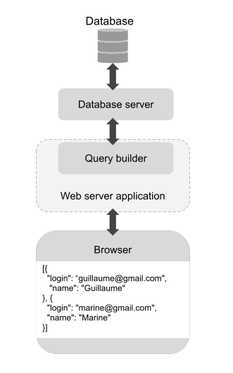
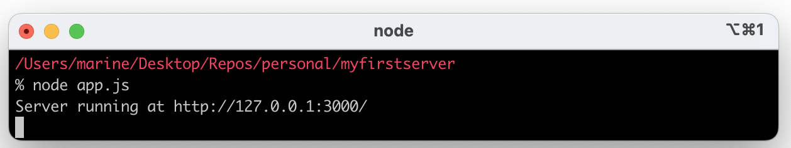
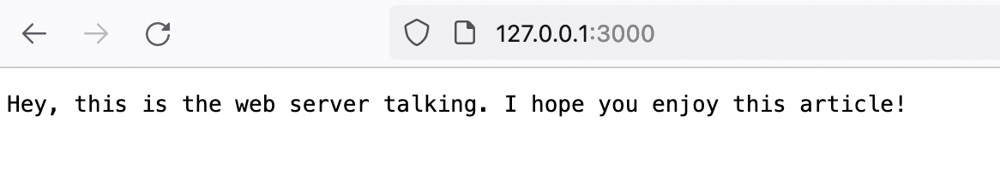

# (Re-)learn backend basics

**In this article, we will (re)learn backend basics by building a minimalist web server that displays the content of a minimalist database in the browser using `NodeJS`, `KnexJS`, and `SQLite3`.**

> I have been a frontend developer for a while. Almost a decade, to be accurate. And when I say frontend, I mean it. During my career, I acquired useful knowledge about CI jobs, deployment pipelines and these kinds of tooling stuff, but two days before I write this, the last time I saw a line of SQL was during my studies about twelve years ago. And let's make it clear: I am not the most passionate developer on Earth, I don't like coding on Sunday, so the number of situations and issues I encounter is generally limited to what my job offers. But I do have project ideas and sometimes I am in a mood I want to achieve them. One of my projects required me to (re)learn the basics of backend development: manage a small database and build an API for my frontend. I wrote this article to share my findings and tips.

## Prerequisites

To appreciate this article, I recommend to:

- Have a basic knowledge of applications architecture

- Be familiar with the command line tool of your OS

- Have a basic knowledge of SQL (10 years without writing a SQL line is ok as long as you remember what it is)

- Have a basic knowledge of javascript

## Definition of "basics"

As different as web applications are, and as varied as the services they offer, the main functional blocks of a web app remain the same:




- The database is the ensemble of files that contain the data related to your application resources. For instance, the list of all your users and their profile data.

- To access and modifies the database, you need to use a database server or database engine, and make requests to it using SQL.

- The web server (= backend server) is the server that will receive and handle the requests from the frontend. It's a backend application, and as such, it can be complex, organized, tested, can have dependencies, etc...

- The query builder is a dependency of the web server. It provides an API to communicate with the database server. You need a query builder that fits your web server. For instance, if you use `NodeJS`, your backend will be a javascript application, so you need to pick a javascript query builder.

Once you have all these blocks put in place in your local environment, you have a minimalist web application that stores and retrieves your testing data.

This is what we will do in the following sections. We will write the content of a database table in the browser. Before we put theory into practice, let's see the hard point that encouraged me to write an article about just that.

## Docs are fine, binding docs together is harder

Open-source libraries and tools are generally documented (the point of creating a library is to encourage people to use it) and this is fine. The problem is more about binding docs together. As libraries are often integrable in various stacks, the documentation generally focuses on the library's specific job, without providing a lot of details about the context. It makes sense, but it also makes our life quite hard when we try to achieve something out of our domain of expertise. 

For instance, let's have a look at `KnexJS` documentation. 

`KnexJS` is a javascript query builder. Here are the configuration options: https://KnexJSjs.org/guide/#configuration-options. Ok, so to start using `KnexJS`, you probably have to write this somewhere. Here is the documentation to send a select request to the database engine: https://KnexJSjs.org/guide/query-builder.html#KnexJS. Ok, so if you want to select the content of a database table, you probably have to write this kind of line somewhere. The question is...

Where? `KnexJS` documentation documents `KnexJS`. You don't have a clue about where you need to write this stuff, it depends on the backend application's architecture.

As a developer, the main hard point I encountered in my career with documentation usage has been not having a doc about how to bind the docs. Integration documentation does exist, but most of the time it concerns big widely used tools you pay for. For instance, in the Sentry guide: https://docs.sentry.io/platforms/javascript/ you have a bunch of "Related guides" to detail the integration of Sentry in main frontend frameworks.

And this is where this article becomes (I hope) handy. We are going to use a web server (`NodeJS`), a query builder (`KnexJS`), and a database engine (`SQLite3`) to make a minimalist project and get back to the backend basics.

## Start with the ends

That's surely one of the best tips I'll ever give you. Try to figure out the blocks, draw the architecture schema like the one introduced a few paragraphs above, then start with the ends. If you are not familiar with running a web server locally, the query builder is already a step too far. If you want to understand the API of the query builder, first start with understanding how to work with the database engine.

To prepare the following steps, create a working folder `my-first-server` and go there with the command line tool.

### `SQLite3`: the database engine

Here is the documentation of the database engine `SQLite3`: https://www.sqlite.org/index.html Very old school. The reason why I suggest `SQLite3` for a quick start is that your local database is going to be a simple file in your working folder.

Download `SQLite3`. The Homebrew install is available on MacOS: `brew install sqlite3`.

To keep things simple, I suggest you have a look at the page `cli.html` that explains how to use `SQLite3` in the command line tool: https://sqlite.org/cli.html

Go through the example, but maybe make it closer to the final app you have in mind: 

- `ex1` is the name of the database file that will be created in your working folder (I called mine `reliuredb` because "Reliure" is the name of the application I work on.)

- Instead of `tbl1(one text, two int)` you could have something more meaningful like `users(login text, name text)`

- And instead of `values('hello!',10)` you could have `values('belette@gmail.com', 'Super Belette')`

It brings back memories of my programming studies.

So basically, when you'll use a query builder in your backend application, the API will fit the kind of SQL queries you can make using the command line tool right now.

### `NodeJS`: the web server

Let's focus on the other end, the server. A server runs at a certain location, identified by an address (for example 127.0.0.1) and a port (for example 3000):



When a server runs locally, enter the location in your browser URL bar to display the server responses in the browser. In other words, you don't even need to set up a frontend application to get back to backend basics, you can test the chain "backend server <-> query builder <-> database server <-> database" just by running the backend server:



Here is the official page of `NodeJS`: https://nodejs.org/en/ We'll use node because it's an easy way to go if you are a frontend developer (and that's what I am).

Download `NodeJS`. The Homebrew install is available on MacOS: `brew install node`.

Have a look at the Getting Started guide: https://nodejs.org/en/docs/guides/getting-started-guide/ which is very straightforward. In your working folder, do exactly that: copy-paste the example in a file `app.js`, run `node app.js` in your command line tool and visit the address on your browser to see the "Hello World". This basic example teaches a few things:

- The `server` created with `http.createServer()` is the main object that will receive a request and return a response.

- What the browser renders is the response contained in `res.end()`. So if we want to display the content of our database table in the browser, we have to pass it to this `end()` function.

- Using `console.log` (like it is done in `server.listen()`) prints messages in the command line tool (good to know for debugging).

And this is it. We have a minimalist "Hello world" backend server running. The next step is to create the link between this server and the database file we have created with `SQLite3`. That's the role of the query builder. But to import a query builder, we first need our backend application to be able to install external dependencies. For now, our working folder `my-first-server` contains only the database file and `app.js`. Let's make this folder an actual package managed by a package manager. In this example, let's use `npm`:

```
npm init
```

When you run this command, you are asked a few questions to set up the package configuration. At the end of the process, a beautiful `package.json` file appears in the working folder. Now it starts looking to a real application ;)

### `KnexJS`: the query builder

Go back to `KnexJS` documentation https://knexjs.org/guide/ that was previously linked in the first sections.

As our backend application now relies on a package manager, we can follow the install documentation for Node: https://knexjs.org/guide/ In our case, you will run:

```
npm install knex --save
npm install sqlite3
```

Then follow the doc about the configuration options: https://knexjs.org/guide/#configuration-options Give it a try by yourself and compare your result with the solution below:

```js
// app.js

const http = require('http');

const knex = require('knex')({
  client: 'sqlite3',
  connection: {
    filename : 'reliuredb'
  },
  useNullAsDefault: true
});

// ...

const server = http.createServer(async (req, res) => { 
  // ...
});

// ...
```

- `knex` is a constant you import at the beginning of the `app.js` file.

- The client is `sqlite3` and the `connection.filename` is the name you chose for the database file.

- `useNullAsDefault: true` is a flag that will get rid of a warning when using `KnexJS` API to access our minimalist database.

The next step is to use `KnexJS` API to select the database table and print its content in the browser. Once again, I encourage you to try to achieve this by yourself. Here is a valid solution:

```js
// app.js

// ...

const server = http.createServer(async (req, res) => { 
  let users = await knex.select().from('users')
  console.log(users);

  res.statusCode = 200;
  res.setHeader('Content-Type', 'text/plain');
  res.end(JSON.stringify(users, 0, 2));
});

// ...
```

- One unclear point (in my opinion) of `KnexJS` documentation is the fact the functions are asynchronous. When reading further, you can see in the doc references to `then()` that plants the idea. So in the example above I set the function parameter `async` and used the `await` keyword to wait for the data from the table `users`.

- `JSON.stringify` allows me to have a nice-to-read indented display in the browser: https://developer.mozilla.org/en-US/docs/Web/JavaScript/Reference/Global_Objects/JSON/stringify

Run the server again with `node app.js`. If everything is fine, you should see your own table data in the browser!

## Last word

This is it! We have built a minimalist web server able to access a database, the very basics of backend development. My hope is with this little project in mind, backend libraries documentation will sound a little less obscure and you'll be able to keep learning and complexifying your code at the top of it. That's what I wish for myself =D